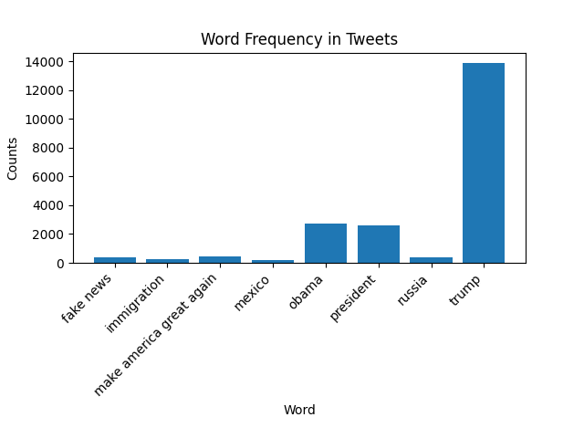
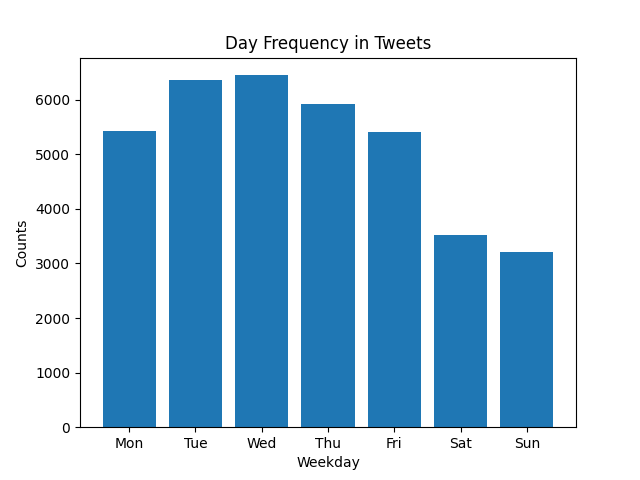
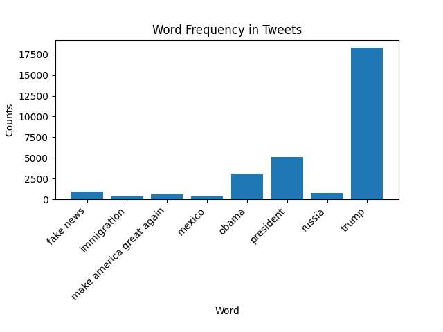

# Word Frequency Percentage

Total *number* of tweets by Trump analyzed by from 2009-2018: **36307**

|      Phrase     |   Percent of Tweets  |
|---------------|----------------------|
|            trump |  38.35% |
|            obama |   7.47% |
|           mexico |   0.55% |
|           russia |   1.13% |
|        fake news |   0.92% |
|        president |   7.21% |
| make america great again |   1.27% |
|      immigration |   0.64% |

# Bar Graph

This graph includes all the data from the table above.

# Extra Credit 1

This graph shows the amount of tweets Trump sent per day of the week from 2009-2018

# Extra Credit 2

This table shows the total *number* of tweets by Trump analyzed from the latest version of the data: **56571**

|      Phrase     |   Percent of Tweets  |
|---------------|----------------------|
|            trump |  32.45% |
|            obama |   5.51% |
|           mexico |   0.62% |
|           russia |   1.32% |
|        fake news |   1.66% |
|        president |   9.03% |
| make america great again |   1.04% |
|      immigration |   0.59% |

### Bar Graph

This is the bar graph showing the current data from Trump's tweets.

